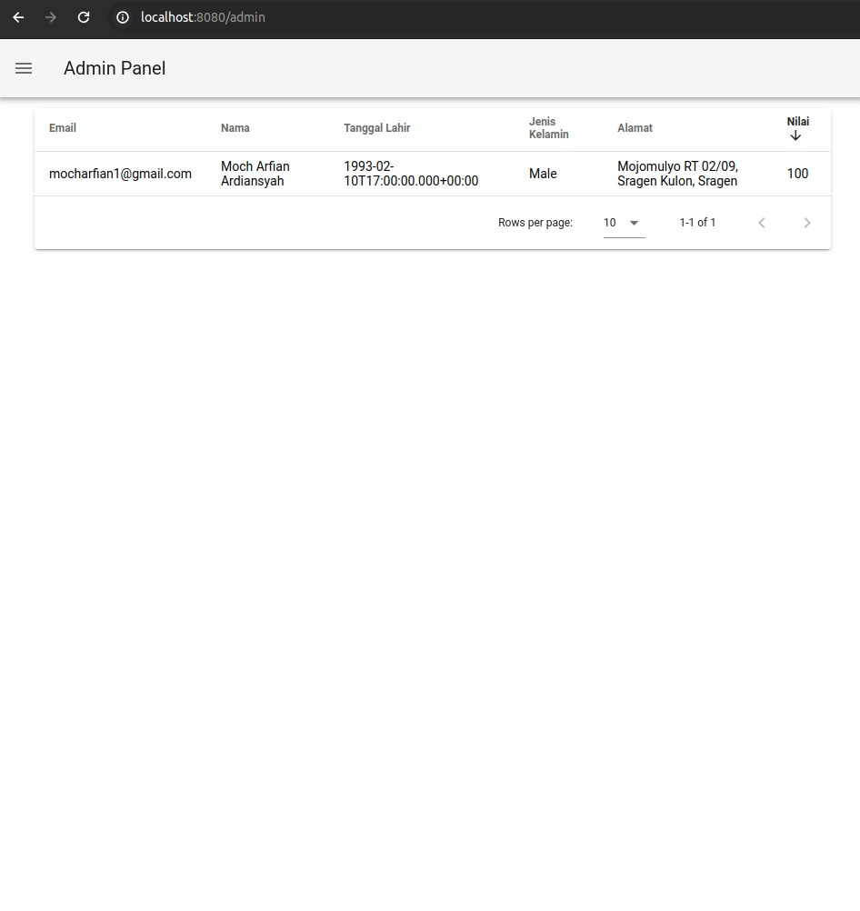
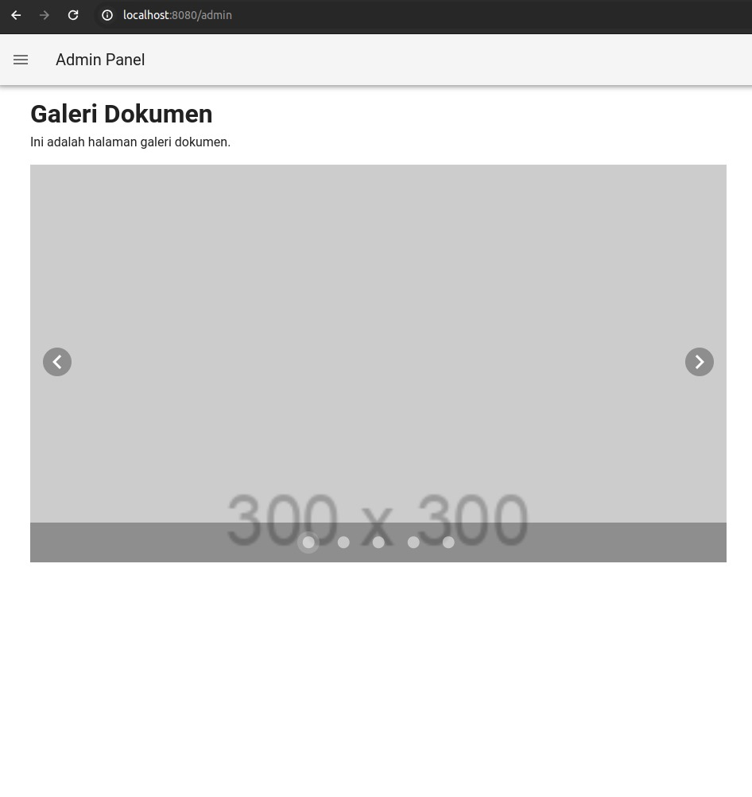
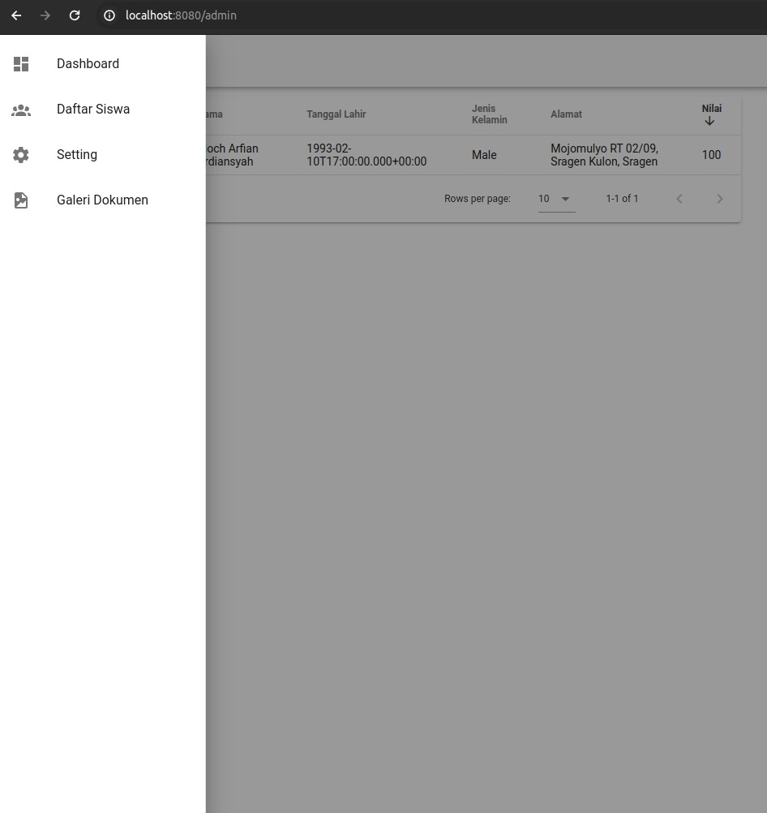
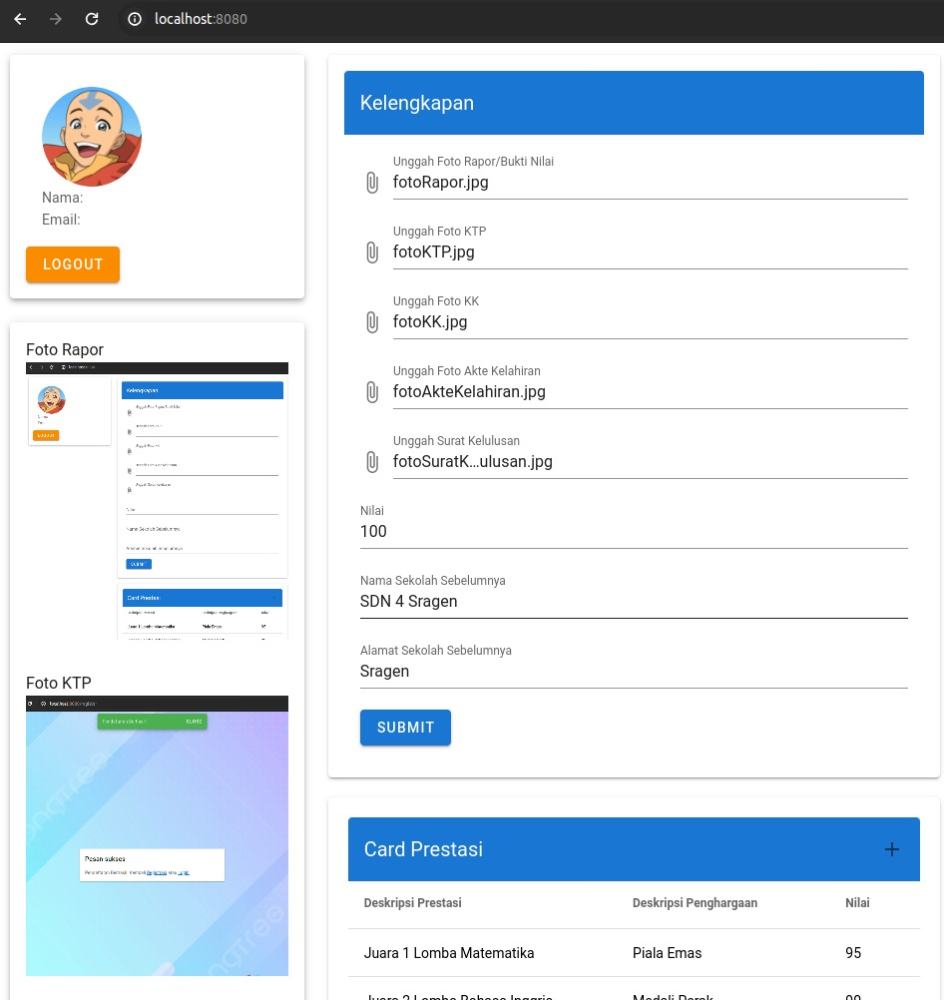
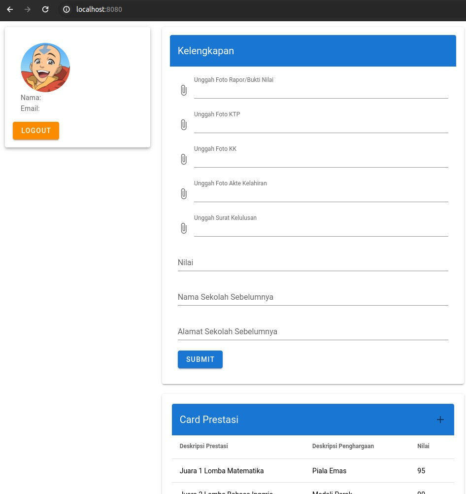
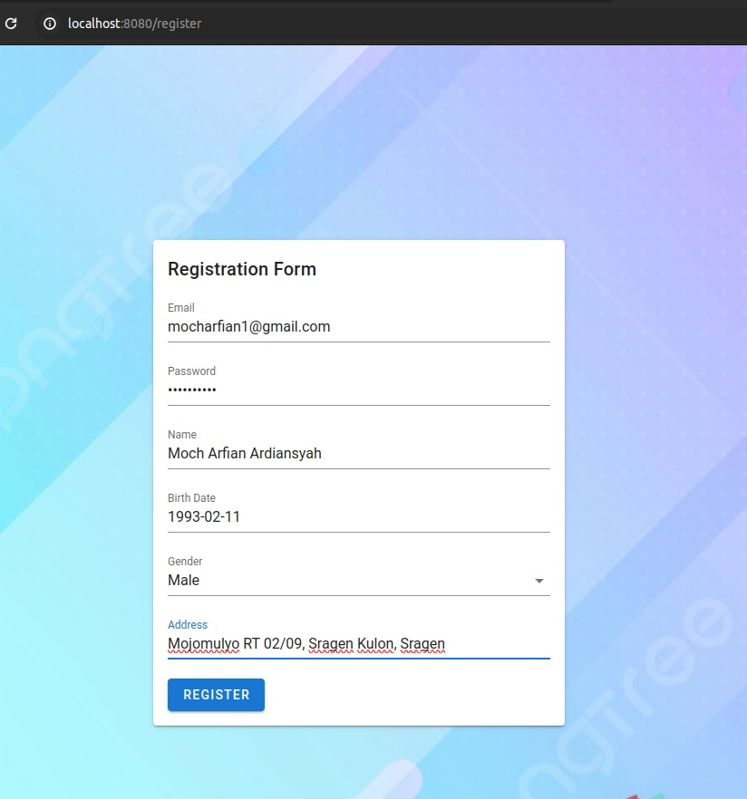
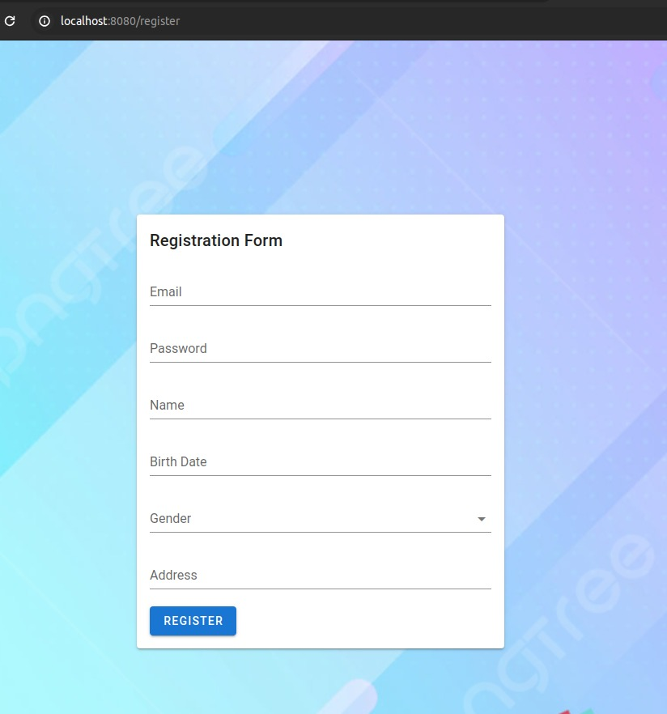
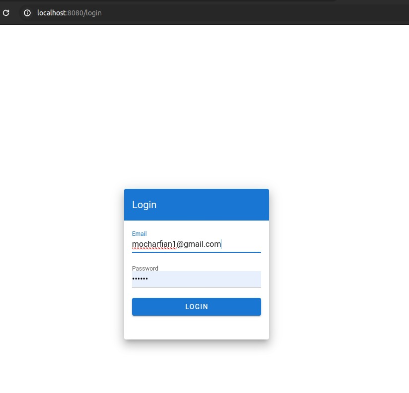

# Pendaftaran Siswa Baru

## Deskripsi
Project ini bertujuan untuk menyediakan platform pendaftaran siswa baru ke sebuah sekolah. Terdapat beberapa fitur yang disediakan, seperti UI untuk login dan registrasi, dashboard admin untuk manajemen data siswa, UI untuk siswa untuk melihat informasi pribadi mereka, serta fitur unggah dan galeri untuk berkas dokumen pendaftaran.

## Fitur-fitur
1. **UI untuk Login**: Halaman login untuk pengguna dengan validasi form.
2. **Registrasi**: Halaman registrasi untuk siswa baru dengan validasi form.
3. **Admin Dashboard**: Halaman dashboard admin untuk manajemen data siswa, termasuk penambahan, pengeditan, dan penghapusan data siswa.
4. **UI Untuk Siswa**: Halaman untuk siswa melihat informasi pribadi mereka, seperti profil dan status pendaftaran.
5. **Upload Berkas Dokumen Pendaftaran**: Fitur unggah berkas dokumen pendaftaran, seperti foto, surat lulus, dll.
6. **Galeri Berkas Dokumen**: Halaman galeri untuk melihat dan mengelola berkas dokumen yang diunggah.

## Teknologi yang Digunakan
- **Frontend**:
    - Vue.js: Framework JavaScript untuk pengembangan antarmuka pengguna yang responsif.
    - Vuetify: Framework komponen UI berbasis Material Design untuk Vue.js.
    - Axios: Library HTTP client untuk melakukan permintaan ke backend.
- **Backend**:
    - Java Spring Boot: Framework pengembangan aplikasi Java yang cepat dan kuat.
    - H2: Sistem manajemen basis data relasional dan embeded untuk menyimpan data siswa dan dokumen pendaftaran.
- **Authentication**:
    - Manual session untuk menandai bahwa yang sedang login adalah dengan ID tertentu.
- **Storage**:
    - Base64 based pada DB: Untuk menyimpan berkas dokumen pendaftaran yang diunggah oleh pengguna.

## Struktur Proyek
```
project
│ README.md
│
└───frontend
│ │ ...
│
└───backend
│ ...
```


## Langkah-langkah Penggunaan
1. **Persiapan Environment**: Pastikan environment pengembangan Anda sudah terpasang dengan Java, Node.js, H2 Driver, dan Maven.
2. **Setup Backend**:
    - Clone repositori backend.
    - Konfigurasikan koneksi database H2 di file `application.properties`.
    - Jalankan aplikasi backend dengan Maven atau IDE favorit Anda.
3. **Setup Frontend**:
    - Clone repositori frontend.
    - Install dependensi dengan `npm install`.
    - Ketika running java, maka akan running juga untuk Frontend nya
4. **Akses Aplikasi**: Buka aplikasi melalui browser dengan URL yang ditentukan.

## Kontributor
- [Moch Arfian](https://github.com/mocharfian1)

## Jalankan Aplikasi .jar
```java -jar demo-0.0.1-SNAPSHOT.jar```
- maka akan terbentuk database file .db

## Postman Collection
https://documenter.getpostman.com/view/6308048/2sA2rAz2Ys

## Screenshot
- 
- 
- 
- 
- 
- 
- 
- 
- 
- 

---
Happy Coding!
